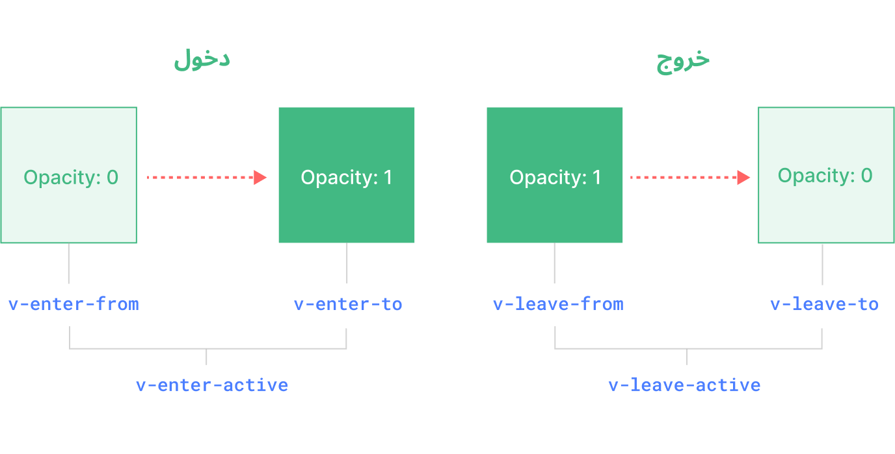

<script setup>
import Basic from './transition-demos/Basic.vue'
import SlideFade from './transition-demos/SlideFade.vue'
import CssAnimation from './transition-demos/CssAnimation.vue'
import NestedTransitions from './transition-demos/NestedTransitions.vue'
import JsHooks from './transition-demos/JsHooks.vue'
import BetweenElements from './transition-demos/BetweenElements.vue'
import BetweenComponents from './transition-demos/BetweenComponents.vue'
</script>

# الانتقال {#transition}

توفر Vue مكونين مدمجين يمكنهما المساعدة في التعامل مع الانتقالات والتحريكات استجابةً لتغيير الحالة:

- المكون `<Transition>` لتطبيق التحريكات عندما يُدخل عنصر أو مكون إلى الـDOM أو إخراجه. ستغطى في هذه الصفحة.

- المكون `<TransitionGroup>` لتطبيق التحريكات عندما يدرج عنصر أو مكون في قائمة `v-for` أو إزالته أو نقله. سيغطى في [الفصل التالي](/guide/built-ins/transition-group).

بصرف النظر عن هذين المكونين ، يمكننا أيضًا تطبيق التحريكات في Vue باستخدام تقنيات أخرى مثل تبديل أصناف CSS أو التحريكات المدفوعة بالحالة عبر ربط التنسيقات تغطى هذه التقنيات الإضافية في [فصل تقنيات التحريك](/guide/extras/animation).

## المكون `<Transition>` {#the-transition-component}

`<Transition>` هو مكون مدمج: هذا يعني أنه متاح في قالب أي مكون دون الحاجة إلى تسجيله. يمكن استخدامه لتطبيق تحريكات الدخول والخروج على العناصر أو المكونات التي مُررت إليه عبر منفذه الافتراضي. يمكن تشغيل الدخول أو الخروج بواسطة إحدى الطرق الموالية:

- التصيير الشرطي عبر `v-if`
- العرض الشرطي عبر `v-show`
- تبديل المكونات الديناميكية عبر عنصر `<component>` الخاص
- تغيير السمة الخاصة `key`

هذا مثال على الاستخدام الأساسي الشائع:

```vue-html
<button @click="show = !show">تبديل</button>
<Transition>
  <p v-if="show">مرحبا</p>
</Transition>
```

```css
/* سنشرح ما تفعله هذه الأصناف في الفصل التالي! */
.v-enter-active,
.v-leave-active {
  transition: opacity 0.5s ease;
}

.v-enter-from,
.v-leave-to {
  opacity: 0;
}
```

<Basic />

<div class="composition-api">

[اختبرها في حقل التجارب](https://play.vuejs.org/#eNp9Us1O8zAQfBV/vvAh0QQJcSkB8SMOcAAEHH0JZlsMjm3Zm1BU9QYXXgSEhBBvk74N6zgqRUKc7J2dGY/XnvI957KmBj7kRZBeOWQBsHY7wqjKWY9syjyM2IyNvK3YClFXhBFGWhOIemPv2XYk/Edfw6owRZ5cSE8FQuV0iUAVY8VVjWgN25VaybttwXv1v7gKvtO+ta/tx/x5/ljkiZpkl740QaHqa0IcawZq1DuQcv7UfrbvpH4p8picKPkPVZEvJaEy4IOO26wZgEHwg1KiamCtQzSUDfQIm0Y3XHgNmXWlVPjA1rPNwKAMsCXMLJouvOKglp3QJpdeOWTrSUKj6mLwNY6B5jlS4+w2WENP0fEFl7ZySoM/dfHsIPgwOcVeqbW9P+6wOHo6MOHyBuTdL/htmERM8DMPAXwDgi96WPoxYGofXpzAhPaLZmWva03sP5rnEKyuY8ZE26/NNcVe4nVpj7oPpcz4MhxOEGik/aVi0MicdXzB6ZMd/HH177gb2Uano3ny2Rd78vmH)

</div>
<div class="options-api">

[اختبرها في حقل التجارب](https://play.vuejs.org/#eNp9Us1O3DAQfpWpT63EJkiolzSg/ohDe2irlqMvxju7GBzbsidhEdobXHgREBJCvE32bbDj7LJICCmKZ76Z7/OMZy7ZN+eKrkVWsTpIrxwdcIMLZz3BFGei1QSX3ABMBYmPn7IN4JFab9YeQDix5xWQbzEjy3TEX/zqcqMbHcLGaUEYPYD6uCWyBr5KreTZPmdJBvbhQzo5O+jv+7v+cXWzuqrLnJppR16YoEiNfkQcdBM1GxUic3XdP/UPkX1bly6TylesutyqJLqBLnQyi26ChtBPhCTV4c6AaBQdjkjumTZaFVgnpKIL2C0+B0AR8MvQ95bWzNtmW4lsVhmZFexmSnyqoQy2wyhIa2ZqXpwGa+JwhnzOpG2c0uj/uHR34Kxaz4AzobU9/zVgaRDxwozLE5Rnb+CnYZEwzv56DOg75GwTI+HnSDl8+P83LqK9CTZ22uqY/U7wHwar21RjTvvemmkseytvqPZnkxZNmflROFwQxicdm1pv0nLI5yxu6I93Wn8pd6/YW68eWz4D8HP9Xg==)

</div>

:::tip ملاحظة 
`<Transition>` يدعم فقط عنصر واحد أو مكونًا كمحتوى للمنفذ. إذا كان المحتوى هو مكون ، يجب أن يكون المكون أيضًا له عنصر جذر واحد فقط.
:::

عند إدراج عنصر في مكون `<Transition>` أو إزالته ، يحدث ما يلي:

1. ستقوم Vue تلقائيًا بفحص ما إذا كان العنصر المستهدف له انتقالات أو تحريكات CSS مطبقة. إذا كان الأمر كذلك ، فسيضاف / يزال عدد من [أصناف انتقال CSS](#transition-classes) في توقيتات مناسبة.

2. إذا كان هناك مستمعون لـ [الخطافات البرمجية لـJavascript](#javascript-hooks) ، فستستدعى هذه الخطافات في توقيتات مناسبة.

3. إذا لم تكتشف أي انتقالات / تحريكات CSS ولم توفر خطافات JavaScript ، فستنفذ عمليات DOM للإدراج و / أو الإزالة في إطار التحريكات التالي للمتصفح.

## الانتقالات المعتمدة على الـCSS {#css-based-transitions}

### أصناف الانتقال {#transition-classes}

There are six classes applied for enter / leave transitions.

هناك ستة أصناف تطبق لانتقالات الدخول / الخروج.



<!-- https://www.figma.com/file/rlOv0ZKJFFNA9hYmzdZv3S/Transition-Classes -->

1. `v-enter-from`: بدء الحالة للدخول. يضاف قبل إدراج العنصر، ويزال إطارًا واحدًا بعد إدراج العنصر.

2. `v-enter-active`: حالة نشطة للدخول. تطبق خلال مرحلة الدخول بأكملها. يضاف قبل إدراج العنصر، ويزال عندما ينتهي الانتقال / التحريك. يمكن استخدام هذا الصنف لتحديد المدة والتأخير ومنحنى التخفيف للانتقال الداخل.
3. `v-enter-to`: حالة الانتهاء للدخول. يضاف إطارًا واحدًا بعد إدراج العنصر (في نفس الوقت يزال `v-enter-from`) ، ويزال عندما ينتهي الانتقال / التحريك.

4. `v-leave-from`: بدء الحالة للخروج. يضاف على الفور عند تشغيل انتقال الخروج ، ويزال بعد إطار واحد.

5. `v-leave-active`: حالة نشطة للخروج. تطبق خلال مرحلة الخروج بأكملها. يضاف على الفور عند تشغيل انتقال الخروج ، ويزال عندما ينتهي الانتقال / التحريك. يمكن استخدام هذا الصنف لتحديد المدة والتأخير ومنحنى التخفيف للانتقال الخارج.
6. `v-leave-to`: حالة الانتهاء للخروج. يضاف إطارًا واحدًا بعد تشغيل انتقال الخروج (في نفس الوقت يزال `v-leave-from`) ، ويزال عندما ينتهي الانتقال / التحريك.

`v-enter-active` و `v-leave-active` تمنحنا القدرة على تحديد منحنيات التخفيف المختلفة لانتقالات الدخول / الخروج ، والتي سنرى مثالًا عليها في الأقسام التالية.

### الانتقالات المسماة {#named-transitions}

يمكن تسمية الانتقال عبر خاصية `name`:

```vue-html
<Transition name="fade">
  ...
</Transition>
```

بالنسبة لانتقال مسمى، ستضاف أصناف الانتقال الخاصة به مع بادئة اسمه بدلاً من `v`. على سبيل المثال، سيكون الصنف المطبق للانتقال أعلاه `fade-enter-active` بدلاً من `v-enter-active`. يجب أن يبدو CSS لانتقال التلاشي مثل هذا:

```css
.fade-enter-active,
.fade-leave-active {
  transition: opacity 0.5s ease;
}

.fade-enter-from,
.fade-leave-to {
  opacity: 0;
}
```

### انتقالات الـCSS {#css-transitions}

`<Transition>` يستخدم عادةً بالتزامن مع [انتقالات الـCSS الأصلية](https://developer.mozilla.org/en-US/docs/Web/CSS/CSS_Transitions/Using_CSS_transitions)، كما هو موضح في المثال الأساسي أعلاه. خاصية `transition` في الـCSS هي اختصار يسمح لنا بتحديد جوانب متعددة من الانتقال، بما في ذلك الخصائص التي يجب تحريكها، ومدة الانتقال، و[منحنيات التخفيف](https://developer.mozilla.org/en-US/docs/Web/CSS/easing-function).

فيما يلي مثال متقدم تنتقل فيه خاصيات متعددة، مع مدد مختلفة ومنحنيات تخفيف للدخول والخروج:

```vue-html
<Transition name="slide-fade">
  <p v-if="show">مرحبا</p>
</Transition>
```

```css
/*
 يمكن للانتقالات الداخلة والخارجة 
استخدام مدد ودوال توقيت مختلفة. 
*/
.slide-fade-enter-active {
  transition: all 0.3s ease-out;
}

.slide-fade-leave-active {
  transition: all 0.8s cubic-bezier(1, 0.5, 0.8, 1);
}

.slide-fade-enter-from,
.slide-fade-leave-to {
  transform: translateX(20px);
  opacity: 0;
}
```

<SlideFade />

<div class="composition-api">

[اختبرها في حقل التجارب](https://play.vuejs.org/#eNqFU81u00AQfpVhL01FnKRESJVxK37UAxwAQQ8cfHE243Rbe3e1u3ZTolxQ4dD3QEGVEALxMPbbMOuNkhyicrF3Zr755puZ3QV7ofWgrpDFLLHcCO3Aoqv0aSpFqZVxsACDOSwhN6qEA4IepDKVXElL0At1DSce0HOmwsNUJsPAQvlkOCx1kTkkCyCZVM4pCc95IfjVScrW2Y/8P2WnzX3zo/nV3rW30Kza2+Z7+635Q/9V+wUeB9e9N5u/7V0yDGSB+Nxk0goniFxmJXrqQkwxyrMpErHHEEqDdTeFj5aZmQkZOaVjeDLS85RBHYl8LYky2q/N7+YnyVklQz8Kyh5ui5AjGe60RmbHTMfBtnCE0qGJMu5EjbDwJG5DEUNWFDAajC1gZjFSlXuWyqXn2qUoMKvxPxTHFng1ETya4GeBpnfUJ+dT/znuw9HhPtqgzC+0v6+eUzu1cmXKOBx9u596fmCeFUDpjAt3E8MoFKHdd2NgfeYsXZBczAaXVkm6Wx1fyrgqtSjQvNO+A5uyOFTyMepGXb/pfP4ukbLg5xfIr/b4Ly3tLabDe4MWTU2b3sQcLRhdCJ99fItzOm+CpZpWBaEfCH5Aq4rKawywl5WckuwdXKf2dfdChJyd27O5Q1rMuikv1COXHT5l9GpePdD6Vu54MO7yaJ5s+Q/eukp2)

</div>
<div class="options-api">

[اختبرها في حقل التجارب](https://play.vuejs.org/#eNqFU81u00AQfpVhT6mIk5QIqTJuxY96gAMg6IGDLxt7nG5r765212lKlQsqHPoeKKgSQiAexn4bZr3ND1LUStbu/Pmbb2Z2rtgLrQezGlnMEpsZod1RKnGulXGQY8Hr0sFVKgFy7nhvL8gABl1t5EoDsKfqIgZnagyWhb/ooC8ZrnFJcVjpkjskDSCZ1M4pCc+zUmTnhynzMHAIj/ydsqPmtvnR/Gpv2mtolu1187391vyhe9l+gcfBdOvV5m97kwwDWAA+MVxa4QSBS16hhy5FjlHBcyTgQDLRYN1l6b0VN1MhI6d0DE9Gep4ymEWiuKNEf7Rfm9/NT6KzTIY65BhukpAhGW6VRmqHTOJgkzhC6dBEPHNihqF3bg0RAy9LGA3GFpBbjFTtnnX9+x+iRD7DByAOLGT1RGTRBD8LNL39Phmf+uOgD/t7u2ADs8Koqr8rn1NbuQplKj9rEn25n3q+YR4VQGmeCXcZwygkodl3bWB95mymZCGmgzOrJL22Di9lmaq0KNG8074Cm7J49ahSRtWoizedzb8sYhbs2Slm5zvsZ5bmFpPw3qBFM6NJr32OBowuuI8/vsU5yWtnpfK6pOh7nB/QqrL2HEPYy1rmRHsrrmP7uvKbI+T0xB7PHdJg7oparcaii08Zrdyre0rf0B0PxqtdYot/df5OTQ==)

</div>

### تحريكات الـCSS {#css-animations}

[تحريكات الـCSS الأصلية](https://developer.mozilla.org/en-US/docs/Web/CSS/CSS_Animations/Using_CSS_animations) تُطبق بنفس طريقة تحريكات الـCSS، مع الفرق في أن `*-enter-from` لا تُزال على الفور بعد إدراج العنصر، ولكن عند حدوث حدث `animationend`.

بالنسبة لمعظم تحريكات الـCSS، يمكننا ببساطة تعريفها تحت فئات `enter-active-*` و `leave-active-*`. هذا مثال:

```vue-html
<Transition name="bounce">
  <p v-if="show" style="text-align: center;">
        مرحبا هنا بعض النص النطاط!
  </p>
</Transition>
```

```css
.bounce-enter-active {
  animation: bounce-in 0.5s;
}
.bounce-leave-active {
  animation: bounce-in 0.5s reverse;
}
@keyframes bounce-in {
  0% {
    transform: scale(0);
  }
  50% {
    transform: scale(1.25);
  }
  100% {
    transform: scale(1);
  }
}
```

<CssAnimation />

<div class="composition-api">

[اختبرها في حقل التجارب](https://play.vuejs.org/#eNqNU71u2zAQfpULgSIJEMtOAi+yE6QtMrRDW7QeuSjKSWFMkQJJKQ4Mb/15FHfp0KEN+iby2/RIWY4DBEYm8u6+79Pd6eOcvS7LqK6QxWxsUyNKBxZdVZ5zJYpSGwdzMJjBAjKjC9gn6D5XXKVaWYLe6Ds484ADZyo85Grcb1WIT4HDopSJQ4oAxleVc1rBRSpFOj3jbM3e8ydn5xOd5xLH/RbWUiYmUVY4QTSVFEikK12pFAnu64Qooe6JbK3GGVh3Lz2uSEwuVM/pMoaTQTkbgcOZ6yVS5CqGFJVDM9rIAKy+Nb+bX83PZgmrH6vvdND9X/MXmuXqK8V/ustDs2we9tZf7/tF+fOxUUqM+1uDUxh6omvUNt8LH+8lqRM1wtwLJLTtxLNjWGOEgkE0tCOuFl6jo0pManwZlX5LjcZiJ3ExxfvM0BbtFjBIDF61J4DzY2TaFDHYNJF4MDgkOkAQABjuQB5HJ8Mn4OPBLvQGuiDLhP2wI+Ys+SoTeXRrtSJLBjZnqS5KIdF8LP2clrO40+UskVLfvQ85b8GjLp/eYDp9Jn9rZz7H2SeDFk1NVtrUHHkGXVu+/PKB/LJVLPR1JQm9o/gZrZaV77GFvanUNbW9hQvdvgsPS6h8Yi9nDsk366F8o2ErAc8ZPba3O0Z/bPc0Ou22yRb/AZt1Vg0=)

</div>
<div class="options-api">

[اختبرها في حقل التجارب](https://play.vuejs.org/#eNqNU71u2zAQfpULgQIJEMtOAi+yEqQtMrRDW7QetTDyWWFMkQRJKQ4Cb/15FHfp0KEN+iby2/QoWbYDBEYAQff33fG74/GBvTYmqkpkMUtcZoXxF6nCudHWwwSnvJQeHlIFMOGeHx61OoBFX1rVWQDuRt/F4G2JrWcRBP3oS/qbumR4LIzkHskCSK5L77WCy0yKbHaeslAGzuEgyJRdjHWeS0z6LaxNGVuunPCC0hQvkJKudakyJHh7dGKg6onpulrKwPl7GXAFt7lQPa9NDKcDMx+Bx7nvcSlyFUOGyqMdbcoArL7Vv+tf9c96Casfq+8kSP9X/4V6ufpK9p9OeayX9ePB+vS+aXn2t0TJkfR3Giez4URq1JLvNYf3eOZFhe1UuRIFD9kxrDFCwSAaulEz1W2qRF7hy1Lp2iq0DrsSlzO8n1qaotsBNiUGr7q79aGNqbZFDC7jEg8HR5TeXG4Qwz3Ik+h0+AR8MtiH3kAXtDLNfNgx8y7Tairy6NZpRUvaZKcs04UREu1HE/p0KYu7uinjUuq7940vLORx589uMJs947918+BL2SeLDm1Fq7SJedoZ9G346ssH2pedYKEnpST0nuBndFqWgWMLe1OqCdHewTVs3xXhwQmVj93V3CPtzbqp7kUtGnzK6KW+3dP6lu5ZdNZNky3+AwX5WeQ=)

</div>

### أصناف انتقال مخصصة{#custom-transition-classes}

يمكنك أيضًا تحديد أصناف انتقال مخصصة عن طريق تمرير الخاصيات التالية إلى `<Transition>`:

- `enter-from-class`
- `enter-active-class`
- `enter-to-class`
- `leave-from-class`
- `leave-active-class`
- `leave-to-class`

هذا سيتجاوز أسماء الأصناف التقليدية. هذا مفيد بشكل خاص عندما تريد دمج نظام انتقال Vue مع مكتبة تحريك CSS موجودة مسبقًا ، مثل [Animate.css](https://daneden.github.io/animate.css/):

```vue-html
<!-- نفترض أن Animate.css مضمنة في الصفحة -->
<Transition
  name="custom-classes"
  enter-active-class="animate__animated animate__tada"
  leave-active-class="animate__animated animate__bounceOutRight"
>
  <p v-if="show">مرحبا</p>
</Transition>
```

<div class="composition-api">

[اختبرها في حقل التجارب](https://play.vuejs.org/#eNqNUs1uEzEQfhXjS0Fq1qrKKWyrAuoBDhSVHi1VjneSOPXaK3ucBkW5wYUXASEhxNskb8PYu017qKruZe3vx/5mxmv+tuuqZQI+5nXUwXTIImDqTqUzbecDsjULMGUbNg2+ZQckPZBOOu1dJOnc37KTLHiJIcEr6WrRn0J+2iC0nVUIeYf1JCF6x860NfrmRPLB/SL/JT/d/t7+2v7d/dh9q0UvJRtj9VVQLho0nk5k9DnVArl1iujbkbYqRoiS9yQ4hDBSGs0Seo6kimqhFNfXw6JhewRVo+68FhSZnu+d+OQ0XCS8NLM59qeUyBS6Y8uRmQ5FUnG779t/2z9U4M9a5OaSRNwXRkAtHjbL1RG/2rw8G8Yg+Ryxi2MhdOMWsdLWp2ZqVYBK+1aohVoJayZRDPEqHaN4XR1VR3ukNS6jkr8pcyoX8EOOkYY5NbNqEb2jd7DO6ai/vu2MhXDR5YTkGrPCZE5Z628/FizP/fAO13PQN4/gi7jKmOSfA0QIS5B8z6EKM6DuZfr8yydY0XpPtr5JltRPkJcQvU3leRTZu+Qaiv1AV9J+KG00bnYVz1cI1PihqBw0KzdFLzm98PdPlH4f97g6Lj7pNnzzH2AfJv0=)

</div>
<div class="options-api">

[Try it in the Playground](https://play.vuejs.org/#eNqNUcFuwjAM/RUvp+1Ao0k7sYDYF0yaOFZCJjU0LE2ixGFMiH9f2gDbcVKU2M9+tl98Fm8hNMdMYi5U0tEEXraOTsFHho52mC3DuXUAHTI+PlUbIBLn6G4eQOr91xw4ZqrIZXzKVY6S97rFYRqCRabRY7XNzN7BSlujPxetGMvAAh7GtxXLtd/vLSlZ0woFQK0jumTY+FJt7ORwoMLUObEfZtpiSpRaUYPkmOIMNZsj1VhJRWeGMsFmczU6uCOMHd64lrCQ/s/d+uw0vWf+MPuea5Vp5DJ0gOPM7K4Ci7CerPVKhipJ/moqgJJ//8ipxN92NFdmmLbSip45pLmUunOH1Gjrc7ezGKnRfpB4wJO0ZpvkdbJGpyRfmufm+Y4Mxo1oK16n9UwNxOUHwaK3iQ==)

</div>

### استخدام الانتقالات و التحريكات معا {#using-transitions-and-animations-together}

تحتاج Vue إلى إضافة مستمعين للأحداث لمعرفة متى ينتهي الانتقال. يمكن أن يكون إما `transitionend` أو `animationend` ، اعتمادًا على نوع قواعد CSS المطبقة. إذا كنت تستخدم أحدهما فقط ، فيمكن لـ Vue اكتشاف النوع الصحيح تلقائيًا.

و مع ذلك ، في بعض الحالات قد ترغب في الحصول على كلاهما على نفس العنصر ، على سبيل المثال وجود تحريك CSS يشغل بواسطة Vue ، جنبًا إلى جنب مع تأثير انتقال CSS في حالة التحويم. في هذه الحالات ، سيتعين عليك إعلان النوع الذي تريد أن يهتم Vue به صراحة عن طريق تمرير خاصية `type` ، بقيمة إما `animation` أو `transition`:

```vue-html
<Transition type="animation">...</Transition>
```

### انتقالات متداخلة ومدد انتقالية صريحة {#nested-transitions-and-explicit-transition-durations}

بالرغم من أن أصناف الانتقال تُطبق فقط على العنصر الابن المباشر في `<Transition>` ، يمكننا تطبيق الانتقال على العناصر المتداخلة باستخدام محددات CSS المتداخلة:

```vue-html
<Transition name="nested">
  <div v-if="show" class="outer">
    <div class="inner">
      مرحبا
    </div>
  </div>
</Transition>
```

```css
/* قواعد تستهدف العناصر المتداخلة */
.nested-enter-active .inner,
.nested-leave-active .inner {
  transition: all 0.3s ease-in-out;
}

.nested-enter-from .inner,
.nested-leave-to .inner {
  transform: translateX(30px);
  opacity: 0;
}

/* ... القواعد الأخرى غير اللازمة محذوفة */
```

يمكننا حتى إضافة تأخير انتقال إلى العنصر المتداخل عند الدخول ، مما يخلق تسلسل تحريك دخول متداخل:

```css{3}
/* تأخير دخول العنصر المتداخل لتأثير متسلسل */
.nested-enter-active .inner {
  transition-delay: 0.25s;
}
```

ومع ذلك ، هذا يخلق مشكلة صغيرة. بشكل افتراضي ، يحاول عنصر `<Transition>` تحديد متى انتهى الانتقال تلقائيًا عن طريق الاستماع إلى **أول** حدث `transitionend` أو `animationend` على عنصر الانتقال الجذر. مع انتقال متداخل ، يجب أن يكون السلوك المطلوب الانتظار حتى تنتهي الانتقالات لجميع العناصر الداخلية.

في مثل هذه الحالات ، يمكنك تحديد مدة انتقال صريحة (بالجزء من الثانية) باستخدام خاصية `duration` على عنصر `<transition>`. يجب أن تتطابق المدة الإجمالية مع التأخير بالإضافة إلى مدة الانتقال للعنصر الداخلي:

```vue-html
<Transition :duration="550">...</Transition>
```

<NestedTransitions />

[اختبرها في حقل التجارب](https://play.vuejs.org/#eNqVVd1u0zAUfpVDuNgPa9MxDWmhm4BpEnABCHYBUm5c57TxltiR7bSdpt7BDS8CQkKIt+nehmM7bdMyBqiVYp+f73znO45zHT2tqu64xiiJ+oZrUVkwaOvqJJWirJS2cA0ahzCDoVYlbFHoVipTyZU0FJqrCRy7gG2ra9xJZT8OKJRPG4tlVTCLtAPoD2prlYQnvBD88jiNmux77plGJ/Nv86/zHzefbz724xAa0s41k0ZYQalZrZlbUPLhYS+NQLISaSPRWMwIwyVQSibGMO6IYVOEAnnBjKGtqi3qZWATunAKKVfO1Lrfzaf5z/l3IvZlmRFTyqLQct2PVzTJ0I9brdPW2KvCLbu+/h50fSm4JqcdMH450qqWWQL3EfGxw6tYlgk5SuCgV029pRSyk6MY5TaB/V6wzpyDUBs0WgKswXHOW2FBpg5K4tBh3IoxEpXGWiAbY2MNxOyyowRYUUCve2AAmcEOUaFGAnK8CxkW7Ao8AKghcddUArDA0j1341XpzSIAqyIdD5NQmYeHJmBvcnZncG8TzaoW0lDpMglLp/6HbaffjhdQVYwL6woswIn6BIEzSe0Z1aICocCiBQO1oWEsrIbM3Cpt1lprq9rM9zeqa95mXv+psi/jVF6n+DcqmxP9R7H/1AhpvsK9Xfr3LenjXX8C7XM6m8D84QQGpzlVQDh6BIN6BEJCzmRWtIRuJtaSyHTDi3eeCwP0l8pSMGYUTPnK5sRooNXEIE1H6WWJowcwIR8CRbhqASVnBgaIEoZiipmHdjK2j0q319sP8tDN5l/iaC+yhq6/oRh1L4ySdHN6DdKIq7ISBerXlaeaRklQx/losmry0tvcTUmCBjvPkV/eYr8wU2dLozcaqZkxptHSZ5keoQ3us3evcErrpbNUWV1Q9B3Ot2hUUTuOIewZjYNot+I82xf+/qdxnJuzqUWaQNOUI+oiZz4+jeibcHpH6yu6B90Dn0d6RrNfIsI/QQ==)

إذا لزم الأمر ، يمكنك أيضًا تحديد قيم منفصلة لمدة الدخول والخروج باستخدام كائن:

```vue-html
<Transition :duration="{ enter: 500, leave: 800 }">...</Transition>
```

### اعتبارات الأداء {#performance-considerations}

قد تلاحظ أن التحريكات الموضحة أعلاه تستخدم في الغالب خصائص مثل `transform` و `opacity`. هذه الخصائص فعالة في التحريكات لأن:

1. لا تؤثر على تخطيط المستند أثناء التحريك ، لذلك لا تؤدي إلى حساب تخطيط CSS المكلف في كل إطار تحريك.

2. يمكن لمعظم المتصفحات الحديثة الاستفادة من تسريع وحدة معالجةالرسوميات GPU  عند تحريك `transform`.

بالمقارنة، خاصيات مثل `height` أو `margin` ستؤدي إلى تخطيط CSS ، لذلك فهي أكثر تكلفة للتحريك ، ويجب استخدامها بحذر. يمكننا التحقق من موارد مثل [CSS-Triggers](https://csstriggers.com/) لمعرفة الخصائص التي ستؤدي إلى تخطيطها إذا قمنا بتحريكها.

## الخطافات البرمجية للتJavascript {#javascript-hooks}

يمكنك الانتقال إلى عملية التحويل مع JavaScript عن طريق الاستماع إلى الأحداث على عنصر `<Transition>`:

```html
<Transition
  @before-enter="onBeforeEnter"
  @enter="onEnter"
  @after-enter="onAfterEnter"
  @enter-cancelled="onEnterCancelled"
  @before-leave="onBeforeLeave"
  @leave="onLeave"
  @after-leave="onAfterLeave"
  @leave-cancelled="onLeaveCancelled"
>
  <!-- ... -->
</Transition>
```

<div class="composition-api">

```js
// تستدعى قبل إدراج العنصر في DOM.
// استخدم هذا لتعيين حالة "enter-from" للعنصر
function onBeforeEnter(el) {}

// تستدعى إطار واحد بعد إدراج العنصر.
// استخدم هذا لبدء تحريك الدخول.
function onEnter(el, done) {
  // استدع دالة رد النداء   done للإشارة إلى نهاية الانتقال 
  // اختياري إذا استخدم بالتزامن مع CSS
  done()
}

// تستدعى عندما ينتهي انتقال الدخول.
function onAfterEnter(el) {}

// called when the enter transition is cancelled before completion.
function onEnterCancelled(el) {}

// تستدعى قبل خطاف الخروج.
// في معظم الأوقات ، يجب عليك فقط استخدام خطاف الخروج
function onBeforeLeave(el) {}

// تستدعى عند بدء انتقال الخروج.
// استخدم هذا لبدء تحريك الخروج.
function onLeave(el, done) {
  // استدع دالة رد النداء   done للإشارة إلى نهاية الانتقال 
  // اختياري إذا استخدم بالتزامن مع CSS
  done()
}

// تستدعى عندما ينتهي انتقال الخروج وأزيل العنصر من DOM.

function onAfterLeave(el) {}

// تتوفر فقط مع انتقالات v-show
function onLeaveCancelled(el) {}
```

</div>
<div class="options-api">

```js
export default {
  // ...
  methods: {
    // تستدعى قبل إدراج العنصر في DOM.
    // استخدم هذا لتعيين حالة "enter-from" للعنصر
    onBeforeEnter(el) {},

    // تستدعى إطار واحد بعد إدراج العنصر.
    // استخدم هذا لبدء التحريك.
    onEnter(el, done) {
      // استدع دالة رد النداء   done للإشارة إلى نهاية الانتقال
      // اختياري إذا استخدم بالتزامن مع CSS
      done()
    },

    // تستدعى عندما ينتهي انتقال الدخول.
    onAfterEnter(el) {},
    onEnterCancelled(el) {},

    // تستدعى قبل خطاف الخروج.
    // في معظم الأوقات ، يجب عليك فقط استخدام خطاف الخروج
    onBeforeLeave(el) {},

    // تستدعى عند بدء انتقال الخروج.
    // استخدم هذا لبدء تحريك الخروج.
    onLeave(el, done) {
      // استدع دالة رد النداء   done للإشارة إلى نهاية الانتقال
      // اختياري إذا استخدم بالتزامن مع CSS
      done()
    },

    // تستدعى عندما ينتهي انتقال الخروج وأزيل العنصر من DOM.

    onAfterLeave(el) {},

    // تتوفر فقط مع انتقالات v-show
    onLeaveCancelled(el) {}
  }
}
```

</div>

يمكن استخدام هذه الخطافات بالتزامن مع انتقالات / تحريكات CSS أو بمفردها.

عند استخدام انتقالات JavaScript فقط ، من المفيد عادة إضافة خاصية `:css="false"` . هذا يخبر Vue بشكل صريح بتخطي كشف انتقال CSS التلقائي. بصرف النظر عن كونها أكثر قليلا في الأداء ، فإن هذا أيضًا يمنع قواعد CSS من التدخل عن طريق الخطأ مع الانتقال:

```vue-html{3}
<Transition
  ...
  :css="false"
>
  ...
</Transition>
```

مع `"css="false:` ، نحن أيضًا مسؤولون بالكامل عن التحكم في متى ينتهي الانتقال. في هذه الحالة ، يتطلب استدعاء دالة رد النداء `done` لخطافات `enter@` و `leave@` . وإلا ، ستستدعى الخطافات بشكل متزامن وسينتهي الانتقال على الفور.

هذا عرض توضيحي باستخدام [مكتبة GreenSock](https://greensock.com/) لتنفيذ التحريكات. يمكنك ، بالطبع ، استخدام أي مكتبة تحريكات أخرى تريدها ، على سبيل المثال [Anime.js](https://animejs.com/) أو [Motion One](https://motion.dev/).

<JsHooks />

<div class="composition-api">

[اختبرها في حقل التجارب](https://sfc.vuejs.org/#eyJBcHAudnVlIjoiPHNjcmlwdCBzZXR1cD5cbmltcG9ydCB7IHJlZiB9IGZyb20gJ3Z1ZSdcbmltcG9ydCBnc2FwIGZyb20gJ2dzYXAnXG5cbmNvbnN0IHNob3cgPSByZWYodHJ1ZSlcblxuZnVuY3Rpb24gb25CZWZvcmVFbnRlcihlbCkge1xuICBnc2FwLnNldChlbCwge1xuICAgIHNjYWxlWDogMC4yNSxcbiAgICBzY2FsZVk6IDAuMjUsXG4gICAgb3BhY2l0eTogMVxuICB9KVxufVxuICBcbmZ1bmN0aW9uIG9uRW50ZXIoZWwsIGRvbmUpIHtcbiAgZ3NhcC50byhlbCwge1xuICAgIGR1cmF0aW9uOiAxLFxuICAgIHNjYWxlWDogMSxcbiAgICBzY2FsZVk6IDEsXG4gICAgb3BhY2l0eTogMSxcbiAgICBlYXNlOiAnZWxhc3RpYy5pbk91dCgyLjUsIDEpJyxcbiAgICBvbkNvbXBsZXRlOiBkb25lXG4gIH0pXG59XG5cbmZ1bmN0aW9uIG9uTGVhdmUoZWwsIGRvbmUpIHtcblx0Z3NhcC50byhlbCwge1xuICAgIGR1cmF0aW9uOiAwLjcsXG4gICAgc2NhbGVYOiAxLFxuICAgIHNjYWxlWTogMSxcbiAgICB4OiAzMDAsXG4gICAgZWFzZTogJ2VsYXN0aWMuaW5PdXQoMi41LCAxKSdcbiAgfSlcbiAgZ3NhcC50byhlbCwge1xuICAgIGR1cmF0aW9uOiAwLjIsXG4gICAgZGVsYXk6IDAuNSxcbiAgICBvcGFjaXR5OiAwLFxuICAgIG9uQ29tcGxldGU6IGRvbmVcbiAgfSlcbn1cbjwvc2NyaXB0PlxuXG48dGVtcGxhdGU+XG4gIDxidXR0b24gQGNsaWNrPVwic2hvdyA9ICFzaG93XCI+VG9nZ2xlPC9idXR0b24+XG5cbiAgPFRyYW5zaXRpb25cbiAgICBAYmVmb3JlLWVudGVyPVwib25CZWZvcmVFbnRlclwiXG4gICAgQGVudGVyPVwib25FbnRlclwiXG4gICAgQGxlYXZlPVwib25MZWF2ZVwiXG4gICAgOmNzcz1cImZhbHNlXCJcbiAgPlxuICAgIDxkaXYgY2xhc3M9XCJnc2FwLWJveFwiIHYtaWY9XCJzaG93XCI+PC9kaXY+XG4gIDwvVHJhbnNpdGlvbj5cbjwvdGVtcGxhdGU+XG5cbjxzdHlsZT5cbi5nc2FwLWJveCB7XG4gIGJhY2tncm91bmQ6ICM0MmI4ODM7XG4gIG1hcmdpbi10b3A6IDIwcHg7XG4gIHdpZHRoOiAzMHB4O1xuICBoZWlnaHQ6IDMwcHg7XG4gIGJvcmRlci1yYWRpdXM6IDUwJTtcbn1cbjwvc3R5bGU+XG4iLCJpbXBvcnQtbWFwLmpzb24iOiJ7XG4gIFwiaW1wb3J0c1wiOiB7XG4gICAgXCJnc2FwXCI6IFwiaHR0cHM6Ly91bnBrZy5jb20vZ3NhcD9tb2R1bGVcIixcbiAgICBcInZ1ZVwiOiBcImh0dHBzOi8vc2ZjLnZ1ZWpzLm9yZy92dWUucnVudGltZS5lc20tYnJvd3Nlci5qc1wiXG4gIH1cbn0ifQ==)

</div>
<div class="options-api">

[Try it in the Playground](https://play.vuejs.org/#eyJBcHAudnVlIjoiPHNjcmlwdD5cbmltcG9ydCBnc2FwIGZyb20gJ2dzYXAnXG4gIFxuZXhwb3J0IGRlZmF1bHQge1xuICBkYXRhKCkge1xuICAgIHJldHVybiB7XG4gICAgICBzaG93OiB0cnVlXG4gICAgfVxuICB9LFxuICBtZXRob2RzOiB7XG5cdFx0b25CZWZvcmVFbnRlcixcbiAgICBvbkVudGVyLFxuICAgIG9uTGVhdmVcbiAgfVxufVxuXG5mdW5jdGlvbiBvbkJlZm9yZUVudGVyKGVsKSB7XG4gIGdzYXAuc2V0KGVsLCB7XG4gICAgc2NhbGVYOiAwLjI1LFxuICAgIHNjYWxlWTogMC4yNSxcbiAgICBvcGFjaXR5OiAxXG4gIH0pXG59XG4gIFxuZnVuY3Rpb24gb25FbnRlcihlbCwgZG9uZSkge1xuICBnc2FwLnRvKGVsLCB7XG4gICAgZHVyYXRpb246IDEsXG4gICAgc2NhbGVYOiAxLFxuICAgIHNjYWxlWTogMSxcbiAgICBvcGFjaXR5OiAxLFxuICAgIGVhc2U6ICdlbGFzdGljLmluT3V0KDIuNSwgMSknLFxuICAgIG9uQ29tcGxldGU6IGRvbmVcbiAgfSlcbn1cblxuZnVuY3Rpb24gb25MZWF2ZShlbCwgZG9uZSkge1xuXHRnc2FwLnRvKGVsLCB7XG4gICAgZHVyYXRpb246IDAuNyxcbiAgICBzY2FsZVg6IDEsXG4gICAgc2NhbGVZOiAxLFxuICAgIHg6IDMwMCxcbiAgICBlYXNlOiAnZWxhc3RpYy5pbk91dCgyLjUsIDEpJ1xuICB9KVxuICBnc2FwLnRvKGVsLCB7XG4gICAgZHVyYXRpb246IDAuMixcbiAgICBkZWxheTogMC41LFxuICAgIG9wYWNpdHk6IDAsXG4gICAgb25Db21wbGV0ZTogZG9uZVxuICB9KVxufVxuPC9zY3JpcHQ+XG5cbjx0ZW1wbGF0ZT5cbiAgPGJ1dHRvbiBAY2xpY2s9XCJzaG93ID0gIXNob3dcIj5Ub2dnbGU8L2J1dHRvbj5cblxuICA8VHJhbnNpdGlvblxuICAgIEBiZWZvcmUtZW50ZXI9XCJvbkJlZm9yZUVudGVyXCJcbiAgICBAZW50ZXI9XCJvbkVudGVyXCJcbiAgICBAbGVhdmU9XCJvbkxlYXZlXCJcbiAgICA6Y3NzPVwiZmFsc2VcIlxuICA+XG4gICAgPGRpdiBjbGFzcz1cImdzYXAtYm94XCIgdi1pZj1cInNob3dcIj48L2Rpdj5cbiAgPC9UcmFuc2l0aW9uPlxuPC90ZW1wbGF0ZT5cblxuPHN0eWxlPlxuLmdzYXAtYm94IHtcbiAgYmFja2dyb3VuZDogIzQyYjg4MztcbiAgbWFyZ2luLXRvcDogMjBweDtcbiAgd2lkdGg6IDMwcHg7XG4gIGhlaWdodDogMzBweDtcbiAgYm9yZGVyLXJhZGl1czogNTAlO1xufVxuPC9zdHlsZT5cbiIsImltcG9ydC1tYXAuanNvbiI6IntcbiAgXCJpbXBvcnRzXCI6IHtcbiAgICBcImdzYXBcIjogXCJodHRwczovL3VucGtnLmNvbS9nc2FwP21vZHVsZVwiLFxuICAgIFwidnVlXCI6IFwiaHR0cHM6Ly9zZmMudnVlanMub3JnL3Z1ZS5ydW50aW1lLmVzbS1icm93c2VyLmpzXCJcbiAgfVxufSJ9)

</div>

## انتقالات قابلة لاعادة الاستخدام {#reusable-transitions}

يمكن إعادة استخدام الانتقالات من خلال نظام المكونات في فيو. لإنشاء انتقال قابل لإعادة الاستخدام ، يمكننا إنشاء مكون يلف مكون `<Transition>` ويمرر محتوى الفتحة:

```vue{5}
<!-- MyTransition.vue -->
<script>
//  شيفرة خطافات الـJavascript
</script>

<template>
  <!-- غلف المكون المدمج Transition -->
  <Transition
    name="my-transition"
    @enter="onEnter"
    @leave="onLeave">
    <slot></slot> <!-- مرر محتوى المنفذ -->
  </Transition>
</template>

<style>
/* 
  CSS ضروري...
  ملاحظة: تجنب استخدام <style scoped> هنا لأنها
  لا تنطبق على محتوى المنفذ.
*/
</style>
```

الآن يمكن استيراد `MyTransition` واستخدامه تمامًا مثل الإصدار المدمج:

```vue-html
<MyTransition>
  <div v-if="show">مرحبا</div>
</MyTransition>
```

## الانتقال عند الظهور {#transition-on-appear}

إذا كنت تريد أيضًا تطبيق انتقال على التصيير الأولي لعنصر ، يمكنك إضافة خاصية `appear`:

```vue-html
<Transition appear>
  ...
</Transition>
```

## الانتقال بين العناصر {#transition-between-elements}

بالإضافة إلى تبديل عنصر مع `v-if` / `v-show` ، يمكننا أيضًا الانتقال بين عنصرين باستخدام `v-if` / `v-else` / `v-else-if` ، طالما تأكدنا من أن هناك عنصر واحد فقط يعرض في أي لحظة:

```vue-html
<Transition>
  <button v-if="docState === 'saved'">تعديل</button>
  <button v-else-if="docState === 'edited'">حفظ</button>
  <button v-else-if="docState === 'editing'">الغاء</button>
</Transition>
```

<BetweenElements />

[اختبرها في حقل التجارب](https://play.vuejs.org/#eNqdVM1OGzEQfhXLl4DEJhTUy3aD+iMO7aGtCpdKe9nsToLBa1v2bApCOVRCPfQtegIhod76w5Ns3qZjO3+0KaLdQ2LPfP5mvpmxz/kzY7rjBnjKM1daYZA5wMbs5UrURltk58zCkE3Y0OqadQjayVWuSq0cskqXB1ggsL4HbXRcMYaqs5mrrBfJiIY2CLWRBPM7zJwpFHN4JqGf87qwI6ESK0ZHmLKdbXOa8732sv3W3rbf2fRietFet1ft1+nn6QVrr+jvE2svyXoTfi/b65RiESNxM5ZVYsxKWThH1ANUCaWJhVBgidUHp/CHtlBOoNCKqaL2OTgpKkgaEzAsfNmgQSTEOBFDQix19vtspjLnc/D8e1pKUZ7cgbMOVAIDeo+E/IxCsl6kXxMOpIN1MRc0Dw4q1ChEvZl+bH/8Z8TI8aCQ86JQ86gvt9SZL78FzXrL0sdu9ahdtMp6qwOisjAbtOze6SA792cq4Qh5ljKhJFmTgdTlyRPvMTpSpzSKxCXGEMxHEEfrEdS0n/gAM+mBb3mqGDgtG/SnAqo7H4sEFIJNitJzbq06JJDomSPS4UIhEUrJtrs7jx2DgkqsG/wbdbha4bw2RSmQ5G2H5APdUNs6jUtfo/cbu3RLNv/kitmg/gemZIWKrlGoO9/i6KjqQzHqHjut6GUIhDkvdW2EBPvGeIEu52kM5X0kVn94FWxoG1+maC+PoDxZYz92dNFTWry14MCOIecLH9KbABjd+wev4ZTWC2etq0YS+h7nOwidpBwj7HmjKkp7BReyfRneNxrxQ7d/ikB9m4nyiXrkJOBzTm/ei3ukL9Pd7e6Gc1RPPvkFMOPjmA==)

## أوضاع الانتقال {#transition-modes}

في المثال السابق ، تحرك العناصر الداخلة والخارجة في نفس الوقت ، وكان علينا جعلها `position: absolute` لتجنب مشكلة التخطيط عندما يتواجد كلا العنصرين في DOM.

ومع ذلك ، في بعض الحالات هذا ليس خيارًا ، أو ببساطة ليست السلوك المطلوب. قد نريد تحريك العنصر الخارج أولاً ، وأن يدرج العنصر الداخل **بعد** انتهاء التحريكات الخارجية. سيكون تنسيق مثل هذه التحريكات يدويًا معقدًا للغاية - لحسن الحظ ، يمكننا تمكين هذا السلوك عن طريق تمرير   خاصية `mode` للمكون `<Transition>` :

```vue-html
<Transition mode="out-in">
  ...
</Transition>
```

هنا المثال السابق مع `"mode="out-in`:

<BetweenElements mode="out-in" />

يدعم `<Transition>` أيضًا `"mode="in-out` ، على الرغم من أنه يستخدم قليلا.

## الانتقال بين المكونات {#transition-between-components}

يمكن أيضًا استخدام `<Transition>` حول [المكونات الديناميكية](/guide/essentials/component-basics#dynamic-components):

```vue-html
<Transition name="fade" mode="out-in">
  <component :is="activeComponent"></component>
</Transition>
```

<BetweenComponents />

<div class="composition-api">

[اختبرها في حقل التجارب](https://sfc.vuejs.org/#eyJBcHAudnVlIjoiPHNjcmlwdCBzZXR1cD5cbmltcG9ydCB7IHNoYWxsb3dSZWYgfSBmcm9tICd2dWUnXG5pbXBvcnQgQ29tcEEgZnJvbSAnLi9Db21wQS52dWUnXG5pbXBvcnQgQ29tcEIgZnJvbSAnLi9Db21wQi52dWUnXG5cbi8vIHVzZSBzaGFsbG93UmVmIHRvIGF2b2lkIGNvbXBvbmVudCBiZWluZyBkZWVwbHkgb2JzZXJ2ZWRcbmNvbnN0IGFjdGl2ZUNvbXBvbmVudCA9IHNoYWxsb3dSZWYoQ29tcEEpXG48L3NjcmlwdD5cblxuPHRlbXBsYXRlPlxuXHQ8bGFiZWw+XG4gICAgPGlucHV0IHR5cGU9XCJyYWRpb1wiIHYtbW9kZWw9XCJhY3RpdmVDb21wb25lbnRcIiA6dmFsdWU9XCJDb21wQVwiPiBBXG4gIDwvbGFiZWw+XG4gIDxsYWJlbD5cbiAgICA8aW5wdXQgdHlwZT1cInJhZGlvXCIgdi1tb2RlbD1cImFjdGl2ZUNvbXBvbmVudFwiIDp2YWx1ZT1cIkNvbXBCXCI+IEJcbiAgPC9sYWJlbD5cbiAgPFRyYW5zaXRpb24gbmFtZT1cImZhZGVcIiBtb2RlPVwib3V0LWluXCI+XG4gICAgPGNvbXBvbmVudCA6aXM9XCJhY3RpdmVDb21wb25lbnRcIj48L2NvbXBvbmVudD5cbiAgPC9UcmFuc2l0aW9uPlxuPC90ZW1wbGF0ZT5cblxuPHN0eWxlPlxuLmZhZGUtZW50ZXItYWN0aXZlLFxuLmZhZGUtbGVhdmUtYWN0aXZlIHtcbiAgdHJhbnNpdGlvbjogb3BhY2l0eSAwLjVzIGVhc2U7XG59XG5cbi5mYWRlLWVudGVyLWZyb20sXG4uZmFkZS1sZWF2ZS10byB7XG4gIG9wYWNpdHk6IDA7XG59XG48L3N0eWxlPiIsImltcG9ydC1tYXAuanNvbiI6IntcbiAgXCJpbXBvcnRzXCI6IHtcbiAgICBcInZ1ZVwiOiBcImh0dHBzOi8vc2ZjLnZ1ZWpzLm9yZy92dWUucnVudGltZS5lc20tYnJvd3Nlci5qc1wiXG4gIH1cbn0iLCJDb21wQS52dWUiOiI8dGVtcGxhdGU+XG4gIDxkaXY+XG4gICAgQ29tcG9uZW50IEFcbiAgPC9kaXY+XG48L3RlbXBsYXRlPiIsIkNvbXBCLnZ1ZSI6Ijx0ZW1wbGF0ZT5cbiAgPGRpdj5cbiAgICBDb21wb25lbnQgQlxuICA8L2Rpdj5cbjwvdGVtcGxhdGU+In0=)

</div>
<div class="options-api">

[اختبرها في حقل التجارب](https://sfc.vuejs.org/#eyJBcHAudnVlIjoiPHNjcmlwdD5cbmltcG9ydCBDb21wQSBmcm9tICcuL0NvbXBBLnZ1ZSdcbmltcG9ydCBDb21wQiBmcm9tICcuL0NvbXBCLnZ1ZSdcblxuZXhwb3J0IGRlZmF1bHQge1xuICBjb21wb25lbnRzOiB7IENvbXBBLCBDb21wQiB9LFxuICBkYXRhKCkge1xuICAgIHJldHVybiB7XG4gICAgICBhY3RpdmVDb21wb25lbnQ6ICdDb21wQSdcbiAgICB9XG4gIH1cbn1cbjwvc2NyaXB0PlxuXG48dGVtcGxhdGU+XG5cdDxsYWJlbD5cbiAgICA8aW5wdXQgdHlwZT1cInJhZGlvXCIgdi1tb2RlbD1cImFjdGl2ZUNvbXBvbmVudFwiIHZhbHVlPVwiQ29tcEFcIj4gQVxuICA8L2xhYmVsPlxuICA8bGFiZWw+XG4gICAgPGlucHV0IHR5cGU9XCJyYWRpb1wiIHYtbW9kZWw9XCJhY3RpdmVDb21wb25lbnRcIiB2YWx1ZT1cIkNvbXBCXCI+IEJcbiAgPC9sYWJlbD5cbiAgPFRyYW5zaXRpb24gbmFtZT1cImZhZGVcIiBtb2RlPVwib3V0LWluXCI+XG4gICAgPGNvbXBvbmVudCA6aXM9XCJhY3RpdmVDb21wb25lbnRcIj48L2NvbXBvbmVudD5cbiAgPC9UcmFuc2l0aW9uPlxuPC90ZW1wbGF0ZT5cblxuPHN0eWxlPlxuLmZhZGUtZW50ZXItYWN0aXZlLFxuLmZhZGUtbGVhdmUtYWN0aXZlIHtcbiAgdHJhbnNpdGlvbjogb3BhY2l0eSAwLjVzIGVhc2U7XG59XG5cbi5mYWRlLWVudGVyLWZyb20sXG4uZmFkZS1sZWF2ZS10byB7XG4gIG9wYWNpdHk6IDA7XG59XG48L3N0eWxlPiIsImltcG9ydC1tYXAuanNvbiI6IntcbiAgXCJpbXBvcnRzXCI6IHtcbiAgICBcInZ1ZVwiOiBcImh0dHBzOi8vc2ZjLnZ1ZWpzLm9yZy92dWUucnVudGltZS5lc20tYnJvd3Nlci5qc1wiXG4gIH1cbn0iLCJDb21wQS52dWUiOiI8dGVtcGxhdGU+XG4gIDxkaXY+XG4gICAgQ29tcG9uZW50IEFcbiAgPC9kaXY+XG48L3RlbXBsYXRlPiIsIkNvbXBCLnZ1ZSI6Ijx0ZW1wbGF0ZT5cbiAgPGRpdj5cbiAgICBDb21wb25lbnQgQlxuICA8L2Rpdj5cbjwvdGVtcGxhdGU+In0=)

</div>

## الانتقالات الديناميكية {#dynamic-transitions}

خاصيات `<Transition>` مثل `name` يمكن أن تكون ديناميكية أيضاً! تسمح لنا بتطبيق انتقالات مختلفة بناءً على تغيير الحالة:

```vue-html
<Transition :name="transitionName">
  <!-- ... -->
</Transition>
```

هذا يمكن أن يكون مفيداً عندما تقوم بتعريف انتقالات / تحريكات CSS باستخدام اصطلاحات صنف الانتقال في Vue وتريد التبديل بينهم.

يمكنك أيضاً تطبيق سلوك مختلف في خطافات الانتقال البرمجية بناءً على الحالة الحالية لمكونك. أخيراً، الطريقة القصوى لإنشاء انتقالات ديناميكية هي من خلال [مكونات الانتقال القابلة لإعادة الاستخدام](#reusable-transitions) التي تقبل خاصيات لتغيير طبيعة الانتقالات المستخدمة. قد يبدو ذلك مبالغاً فيه، لكن الحد الوحيد هو خيالك.

---

**ذات صلة**

- [مرجع الواجهة البرمجية لـ`<Transition>`](/api/built-in-components#transition)
