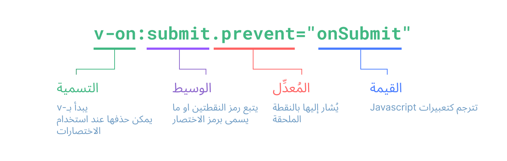

# صيغة القالب {#template-syntax}

Vue تستخدم صيغة القالب المستند على الـHTML التي تسمح لك بربط شجرة الـDOM المصيّرة بشكل تصريحي مع بيانات و دوال شيفرة المكوّن. كل قوالب Vue هي عبارة عن عناصر HTML صحيحة يمكن تحليلها بواسطة المتصفّحات و مصرفي الـHTML الخاضعة للمواصفات.

خلف الستار، يقوم Vue بتحويل القوالب إلى شيفرة JavaScript محسّنة بشكل كبير مقترنة مع المنظومة التفاعلية، يمكن لـVue تحديد عدد أدنى من المكوّنات من أجل إعادة التصيير و تطبيق حد أدنى من التعديلات على شجرة الـDOM عند تغيير حالة التطبيق.

إذا كنت معتادًا على مفاهيم الـDOM الافتراضي و تفضّل القوة الخام لـJavaScript، يمكنك أيضًا [كتابة دوال التصيير ](/guide/extras/render-function)  مباشرة بدلاً من القوالب، مع دعم اختياري للـJSX . ومع ذلك، يرجى ملاحظة أنها لا تتمتع بنفس مستوى التحسينات في وقت التصيير مثل القوالب.

## الاقحام النصي {#text-interpolation}

أسهل شكل لربط البيانات هو الاقحام النصي باستخدام صيغة "الشارب" (الأقواس المعقوفة):

```vue-html
<span>رسالة : {{ msg }}</span>
```

سيستبدل وسم الأقواس المعقوفة بقيمة خاصية `msg` [من نسخة المكون المقابلة](/guide/essentials/reactivity-fundamentals#declaring-reactive-state). كما ستحدث كلما تغيرت الخاصية `msg`.

##  الـHTML الخام {#raw-html}

تقوم الأقواس المعقوفة بترجمة البيانات كنصّ بدون تصييرها كـHTML. لتصيير HTML حقيقي، ستحتاج إلى استخدام [السمة الموجهة `v-html`](/api/built-in-directives#v-html):

```vue-html
<p>باستخدام الاقحام النصي: {{ rawHtml }}</p>
<p>باستخدام الموجهة v-html : <span v-html="rawHtml"></span></p>
```

<script setup>
  const rawHtml = '<span style="color: red">هذا النص يكون بلون أحمر</span>'
</script>

<div class="demo">
   <p> باستخدام الاقحام النصي : {{ rawHtml }}</p>
   <p>باستخدام الموجهة v-html : <span v-html="rawHtml"></span></p>
</div>

هنا قابلنا شيئًا جديدًا و هو السمة  `v-html` أو ما يسمى بـ **المُوجِّهة**. تبدأ تسمية الموجهات بـ `v-` لتشير إلى أنها سمات خاصة مقدمة من Vue، و كما هو متوقع، فإنها تطبق سلوكًا تفاعليًا خاصًا على شجرة الـDOM المصيّرة. هنا، نقول لل "أبقِ هذا العنصر HTML الداخلي محدّثًا مع قيمة الخاصية `rawHtml` من شيفرة المكوّن النشط الحالي".

محتوى العنصر `span` سيتم استبداله بقيمة الخاصية `rawHtml`، و تم ترجمتها كـHTML خام - و يُهمل الربط مع البيانات. يرجى ملاحظة أنه لا يمكنك استخدام `v-html` لتركيب جزء من قالب مع ربط البيانات و معالجة الأحدات، لأن Vue ليست محرك  مبني على قوالب السلاسل النصية. بدلاً من ذلك، يفضل استخدام المكوّنات كوحدة أساسية لإعادة استخدام و تركيب واجهة المستخدم.

:::warning تحذير أمني
تصيير HTML عشوائي بشكل ديناميكي على موقعك على الويب قد يكون له خطرًا كبيرًا لأنه يمكن أن يؤدي بسهولة إلى [ثغرات XSS](https://en.wikipedia.org/wiki/Cross-site_scripting). استخدم `v-html` فقط على المحتوى الموثوق به و لا تستخدمه **أبدًا** على المحتوى المدخل من قبل المستخدم.
:::

## ربط السمات {#attribute-bindings}

لا يمكن استخدام الأقواس المعقوفة داخل سمات الـHTML لربطها بالبيانات. بدلاً من ذلك، استخدم [الموجهة `v-bind`](/api/built-in-directives#v-bind):

```vue-html
<div v-bind:id="dynamicId"></div>
```

السمة المُوجِّهة `v-bind` تُعلم Vue بأنه يجب أن تبقى السمة `id` متزامنة مع المتغير `dynamicId` للمكوّن النشط. إذا كانت قيمة المتغير المربوط `null` أو `undefined`، فسيتم إزالة السمة من العنصر المُصيّر.

### الإختصار {#shorthand}

بما أن `v-bind` مستخدمة بشكل متكرر، فاختصرت بـ  `:`  :

```vue-html
<div :id="dynamicId"></div>
```

السمات التي تبدأ بـ `:` قد تبدو مختلفة عن الـHTML العادي، لكنها في الحقيقة رمز صالح لتسمية السمات و يمكن لجميع المتصفحات المدعومة من Vue تحليلها بشكل صحيح. بالإضافة إلى ذلك، فإنها لا تظهر في العناصر النهائية المصيّرة. هذه الصيغة تبقى اختيارية، لكنك ستقدر قيمتها عندما تتعلم المزيد عن استخدامها في وقت لاحق.

> فيما يلي من الدليل، سنستخدم الصيغة المختصرة في أمثلة الشيفرة، لأنها هي الأكثر استخدامًا من طرف مطوري Vue.

### السمات المنطقية {#boolean-attributes}

[السمات المنطقية](https://html.spec.whatwg.org/multipage/common-microsyntaxes.html#boolean-attributes) هي السمات التي يمكن أن تشير إلى قيم صحيحة/خاطئة من خلال وجودها على عنصر. على سبيل المثال، [`disabled`](https://developer.mozilla.org/en-US/docs/Web/HTML/Attributes/disabled) هي أحد أكثر السمات المنطقية استخدامًا.

في هذه الحالة، تعمل المُوجِّهة `v-bind` بشكل مختلف:

```vue-html
<button :disabled="isButtonDisabled">زر</button>
```

السمة `disabled` ستُصيَّر على وسم العنصر إذا كانت قيمة المتغير المربوط `isButtonDisabled` [صحيحة](https://developer.mozilla.org/en-US/docs/Glossary/Truthy). أو إذا كانت قيمة المتغير عبارة عن نص فارغ، بحيث تكون متوافقة مع `<button disabled="">...</button>`. للقيم [الخاطئة](https://developer.mozilla.org/en-US/docs/Glossary/Falsy) الأخرى، تُحذف السمة.

### ربط سمات متعددة بشكل ديناميكي {#dynamically-binding-multiple-attributes}

إذا كان لديك كائن JavaScript و خاصياته تمثل سمات متعددة مثل المثال الموالي:

<div class="composition-api">

```js
const objectOfAttrs = {
  id: 'container',
  class: 'wrapper'
}
```

</div>
<div class="options-api">

```js
data() {
  return {
    objectOfAttrs: {
      id: 'container',
      class: 'wrapper'
    }
  }
}
```

</div>

يمكنك ربطها بعنصر واحد باستخدام `v-bind` بدون تمرير وسيط:

```vue-html
<div v-bind="objectOfAttrs"></div>
```

## استخدام تعبيرات الـJavascript {#using-javascript-expressions}

حتى الآن، لم نربط سوى الخاصيات البسيطة في قوالبنا. لكن Vue في الواقع يدعم قوة تعبيرات الـJavaScript كاملة داخل جميع حالات ربط البيانات:

```vue-html
{{ number + 1 }}

{{ ok ? 'لا' : 'نعم' }}

{{ message.split('').reverse().join('') }}

<div :id="`list-${id}`"></div>
```

هذه التعبيرات ستُقيَّم كـشيفرة JavaScript في نطاق البيانات في نسخة العنصر الحالي.

في قوالب Vue، يمكن استخدام تعبيرات JavaScript في الأماكن التالية:

- كنص مقحم داخل الأقواس المزدوجة  
- كقيمة لأي سمة مُوجهة مربوطة (السمات الخاصة التي تبدأ بـ`-v`)

### التعبيرات فقط {#expressions-only}

كل ربط يمكنه أن يحتوي على **تعبير واحد فقط**. بحيث يمكن تحويله إلى قيمة. يمكن استخدام التعبيرات بعد `return` للتحقق من صحتها.

و بالتالي الشيفرة الموالية **لن** تشتغل:

```vue-html
<!-- : هاته تعليمة و ليست تعبيرا  -->
{{ var a = 1 }}

<!-- التحكم في انسياب التعليمات لن يشتغل  أيضا، بدلا من ذلك استخدم التعبير الثلاثي-->
{{ if (ok) { return message } }}
```

### استدعاء الدوال {#calling-functions}

 من الممكن استدعاء دالة مُعرَّفة في الشيفرة الخاصة بالمكون داخل تعبير ربط : 

```vue-html
<time :title="toTitleDate(date)" :datetime="date">
  {{ formatDate(date) }}
</time>
```

:::tip
 تستدعى الدوال داخل تعبيرات الربط كل مرة يُحدَّثُ فيها المكون، لذا يجب أن **لا تكون** لها أي تأثيرات جانبية مثل تغيير البيانات أو تشغيل عمليات غير متزامنة.
:::

### الوصول المحدود للعوامل العامة {#restricted-globals-access}

التعبيرات في القوالب متاحة بشكل مُحدَّد و لها إمكانية الوصول فقط إلى [قائمة محدودة من العوامل العامة](https://github.com/vuejs/core/blob/main/packages/shared/src/globalsAllowList.ts#L3). تعرض القائمة العوامل الأساسية العامة المستخدمة بشكل شائع مثل `Math` و `Date`.

العوامل العامة ليست مضمنة بشكل صريح في القائمة، مثل الخاصيات المرفقة من قبل المستخدم على `window`، لن تكون متاحة في تعبيرات القالب. ومع ذلك، يمكنك تعريف العوامل العامة بشكل صريح لجميع تعبيرات Vue عن طريق إضافتها إلى [`app.config.globalProperties`](/api/application#app-config-globalproperties).

## السمات المُوجِّهة {#directives}

السمات الموجهة هي سمات خاصة تبدأ بـ`v-`،  تقدم Vue مجموعة من [السمات الأساسية](/api/built-in-directives) بما في ذلك `v-html` و `v-bind` التي سردناهما سابقا.

 الموجهات تكون قِيَّمُها عبارة عن تعبيرات JavaScript واحدة (باستثناء `v-for` و `v-on` و `v-slot`، والتي سنتحدث عنها في الأقسام المخصصة لها في وقت لاحق). وظيفة الموجهة هي تطبيق التحديثات الديناميكية على شجرة الـDOM عندما تتغير قيمة التعبير الخاص بها. اختر [`v-if`](/api/built-in-directives#v-if) كمثال:

```vue-html
<p v-if="seen">الآن يمكنك رؤيتي</p>
```

هنا، سيقوم الموجه `v-if` بإزالة / إدراج عنصر `<p>` بناءً على صحة قيمة التعبير `seen`.

### الوسائط {#arguments}

بعض الموجهات يمكنها أخذ "وسيط"، والذي يُعرَف بـ`:` بعد اسم الموجه. على سبيل المثال، يُستخدم الموجه `v-bind` لتحديث السمة HTML بشكل تفاعلي:

```vue-html
<a v-bind:href="url"> ... </a>

<!-- اختصار -->
<a :href="url"> ... </a>
```

هنا، `href` هو الوسيط، و الذي يخبر الموجه `v-bind` بربط السمة `href` للعنصر بقيمة التعبير `url`. اختصارا، كل شيء قبل الوسيط (أي، `:v-bind`) يُختصر إلى رمز النقطتين `:`.

مثال آخر هو الموجه `v-on`، الذي يستمع إلى أحداث الـDOM:

```vue-html
<a v-on:click="doSomething"> ... </a>

<!-- اختصار -->
<a @click="doSomething"> ... </a>
```

هنا، الوسيط هو اسم الحدث الذي سيُستمع إليه: `click`. يمتلك الموجه `v-on` اختصارا مقابل، وهو الرمز `@`. سنتحدث عن معالجة الأحداث أيضا بشكل أكثر تفصيلا.

### الوسائط الديناميكية {#dynamic-arguments}

من الممكن أيضا استخدام تعبيرات الـJavaScript في وسيط الموجه بواسطة إحاطته بأقواس مربعة:

```vue-html
<!-- 
تجدر الملاحظة أن هناك بعض القيود على تعبير الوسيط،
كما هو موضح في الأقسام "قيود قيمة الوسيط الديناميكي" و "قيود صيغة الوسيط الديناميكي" أدناه.
-->

<a v-bind:[attributeName]="url"> ... </a>

<!-- اختصار -->
<a :[attributeName]="url"> ... </a>
```
هنا، سيتم تقييم `attributeName` بشكل ديناميكي كتعبير JavaScript، وسيتم استخدام حالة التقييم النهائية كقيمة للوسيط. على سبيل المثال، إذا كان لديك نسخة مكون لديها خاصية بإسم  `attributeName`، والذي يحتوي على القيمة النصية `"href"`، فإن هذا الربط سيكون مطابقا لـ`v-bind:href`.

بشكل مماثل، يمكنك استخدام الوسائط الديناميكية لربط معالج لاسم حدث ديناميكي:

```vue-html
<a v-on:[eventName]="doSomething"> ... </a>

<!-- اختصار -->
<a @[eventName]="doSomething">
```

في هذا المثال، عندما تكون قيمة `eventName` هي `"focus"`، فإن `v-on:[eventName]` سيكون مطابقا لـ`v-on:focus`.

#### قيود قيمة الوسيط الديناميكي {#dynamic-argument-value-constraints}

الوسائط الديناميكية يُتوقع أن تكون قيمها عبارة عن سلسلة نصية، ما عدا `null`. يمكن استخدام القيمة الخاصة `null` لإزالة الربط بشكل صريح. أي قيمة غير نصية ستُظهر تحذيرا.

#### قيود صيغة الوسيط الديناميكي {#dynamic-argument-syntax-constraints}

الوسائط الديناميكية لها بعض القيود  في كتابة صيغها لأن بعض الرموز مثل المسافات والعلامات التنصيصية، غير صالحة كأسماء سمات في  HTML. على سبيل المثال، العبارة التالية غير صالحة:

```vue-html
<!-- هذا سيسبب تحذيرا من المصرف. -->
<a :['foo' + bar]="value"> ... </a>
```

إذا كنت  تحتاج  تمرير وسيط ديناميكي معقد، فمن المحتمل أن يكون من الأفضل استخدام [خاصية محسوبة](./computed)، والتي سنتحدث عنها باختصار.

عند استخدام قوالب  الـDOM (القوالب المكتوبة مباشرة في ملف HTML)، يجب عليك أيضا تجنب تسمية المفاتيح بحروف كبيرة، لأن المتصفحات ستقوم بتحويل أسماء السمات إلى حروف صغيرة:

```vue-html
<a :[someAttr]="value"> ... </a>
```

التسمية اعلاه ستُحول إلى `:[someattr]` في قوالب الـDOM، إذا كان لديك خاصية `someAttr` بدلا من `someattr`، فلن تعمل شيفرتك. القوالب الموجودة داخل المكونات أحادية الملف ستكون **غير** خاضعة لهاته القيود.

### المُعدِّلات {#modifiers}

المُعدِّلات هي لاحقات خاصة يُشار إليها بواسطة نقطة، والتي تُشير إلى أن السمة يجب ربطها بطريقة معينة. على سبيل المثال، المُعدِّل `prevent.` يُخبر الاتجاه `v-on` بإستدعاء `()event.preventDefault` على الحدث المُشغّل:

```vue-html
<form @submit.prevent="onSubmit">...</form>
```

سنرى أمثلة أخرى للمُعدِّلات في وقت لاحق، عندما نتطرق إلى هذه الميزات، على سبيل المثال [`v-on`](./event-handling#event-modifiers) و [`v-model`](./forms#modifiers).

و أخيرا، هاته هي صيغة المُعدِّل موضحة بالكامل: 



<!-- https://www.figma.com/file/BGWUknIrtY9HOmbmad0vFr/Directive -->
