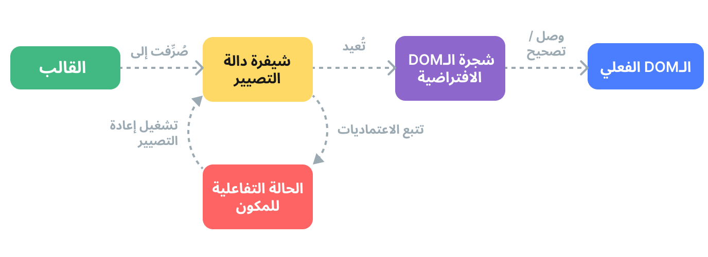

# آلية التصيير {#rendering-mechanism}

كيف تأخذ Vue قالبًا وتحوله إلى عقد DOM فعلية؟ كيف تحدث Vue تلك العقد DOM بكفاءة؟ سنحاول إلقاء الضوء على هذه الأسئلة هنا من خلال الغوص في آلية التصيير الداخلية لـ Vue.

## الـDOM الافتراضي {#virtual-dom}

ربما سمعت عن مصطلح "الـDOM الافتراضي"، الذي يستند عليه نظام التصيير في Vue.

الـDOM الافتراضي (VDOM) هو مفهوم برمجي حيث يحتفظ بتمثيل مثالي أو "افتراضي" لواجهة المستخدم في الذاكرة ومزامنته مع "الـDOM الحقيقي" . وقد ابتكر هذا المفهوم من قبل [React](https://reactjs.org/)، وقد كُيِّف في العديد من الإطارات الأخرى مع تنفيذات مختلفة، بما في ذلك Vue.

الـDOM الافتراضي هو نمط  أكثر منه تقنية محددة، لذلك لا يوجد تنفيذ رسمي واحد. يمكننا توضيح الفكرة باستخدام مثال بسيط:

```js
const vnode = {
  type: 'div',
  props: {
    id: 'hello'
  },
  children: [
    /* المزيد من العقد الافتراضية */
  ]
}
```

هنا، `vnode` هو كائن JavaScript عادي (عقدة افتراضية) تمثل عنصر `<div>` . يحتوي على جميع المعلومات التي نحتاجها لإنشاء العنصر الفعلي. كما يحتوي على المزيد من العقد الافتراضية للعقد الأبناء، مما يجعله جذرًا لشجرة الـDOM الافتراضية.

يمكن للمصيّر في وقت التشغيل تصفح شجرة الـDOM الافتراضية وإنشاء شجرة الـDOM الحقيقية منها. تُسمى هذا العملية **الوصل**.

إذا كان لدينا نسختان من شجرتي الـDOM الافتراضية، يمكن للمصيّر أيضًا تصفح الشجرتين ومقارنتهما، ومعرفة الاختلافات، وتطبيق تلك التغييرات على الـDOM الحقيقي. تُسمى هذه العملية **التصحيح**، وتُعرف أيضًا باسم "المقارنة" أو "المطابقة".

الفائدة الرئيسية للـDOM الافتراضي هي أنه يمنح المطور القدرة على إنشاء وفحص وتركيب هياكل واجهة المستخدم المطلوبة بطريقة تصريحية، مع ترك التلاعب المباشر بالـDOM للمصيّر.

## مجرى التصيير {#render-pipeline}

على المستوى العالي، هذا ما يحدث عند تصيير مكون Vue:

1. **التصريف**: تصرف قوالب Vue إلى **دوال تصيير**: وهي دوال تعيد شجرات الـDOM الافتراضية. يمكن إجراء هذه الخطوة إما مسبقًا عن طريق خطوة البناء، أو على الطائر باستخدام المترجم في وقت التشغيل.

2. **الوصل**: يقوم المصيّر في وقت التشغيل بدعوة دوال التصيير، ويتصفح شجرة الـDOM الافتراضية المُرجعة، وينشئ عقدات الـDOM الفعلية بناءً عليها.  تنفذ هذه الخطوة كـ[تأثير تفاعلي](./reactivity-in-depth)، لذلك يتتبع جميع الاعتماديات التفاعلية التي استخدمت.

3. **التصحيح**: عندما jتغير الاعتمادية المستخدمة أثناء الوصل، يعاد تشغيل التأثير. في هذه المرة، تُنشأ شجرة DOM افتراضية جديدة ومحدثة. يقوم المصيّر في وقت التشغيل بتصفح الشجرة الجديدة، ومقارنتها مع القديمة، وتطبيق التحديثات اللازمة على الـDOM الفعلي.



<!-- https://www.figma.com/file/elViLsnxGJ9lsQVsuhwqxM/Rendering-Mechanism -->

## القوالب مقابل دوال التصيير {#templates-vs-render-functions}

قوالب Vue تُصرف إلى دوال تصيير للـDOM الافتراضي. توفر Vue أيضًا واجهات برمجية تسمح لنا بتخطي خطوة تصريف القوالب وكتابة دوال تصيير مباشرة. تكون دوال التصيير أكثر مرونة من القوالب عند التعامل مع شيفرة منطقية متغيرة للغاية، لأنه يمكنك العمل مع vnodes باستخدام كامل قوة الـJavaScript.

لذا لماذا توصي Vue بالقوالب افتراضيًا؟ هناك عدد من الأسباب:

1. القوالب أقرب إلى HTML الفعلي. هذا يجعل من الأسهل إعادة استخدام مقتطفات HTML موجودة، وتطبيق أفضل الممارسات لشمولية الوصول، والتنسيق باستخدام CSS، وللمصممين سهولة فهمها وتعديلها.

2. القوالب أسهل في التحليل الثابت بسبب  صيغتها المحددة. هذا يسمح لمصرف قوالب Vue بتطبيق العديد من التحسينات في وقت التصيير لرفع أداء الـDOM الافتراضي (الذي سنناقشه لاحقا).

عمليًا، القوالب كافية لمعظم الحالات الاستخدام في التطبيقات. تستخدم دوال التصيير عادةً في المكونات القابلة لإعادة الاستخدام التي تحتاج إلى التعامل مع شيفرة تصيير متغيرة للغاية. سنناقش استخدام دوال التصيير بالتفصيل في [دوال التصيير وJSX](./render-function).

## مصرف الـDOM الافتراضي المطلع {#compiler-informed-virtual-dom}

تنفيذ الـDOM الافتراضي في React ومعظم تنفيذات الـDOM الافتراضي الأخرى هي في الأساس في وقت التشغيل: لا يمكن لخوارزمية المطابقة أن تفترض أي شيء عن شجرة الـDOM الافتراضي الواردة، لذلك يجب عليها أن تمر بالكامل على الشجرة وتقارن بين خصائص كل عقدة افتراضية vnode لضمان الصحة. بالإضافة إلى ذلك، حتى لو لم يتغير جزء من الشجرة أبدًا، فإن عقد جديدة تُنشأ دائمًا لها في كل مرة يعاد فيها التصيير، مما يؤدي إلى ضغط غير ضروري في الذاكرة. هذا هو أحد أكثر الجوانب المنتقدة في الـDOM الافتراضي: تضحي عملية المطابقة القوية إلى حد ما بالكفاءة مقابل الصيغة التصريحية وصحتها.

ولكن لا يجب أن يكون الأمر كذلك. في Vue، يتحكم الإطار في المصرف ووقت التشغيل. هذا يسمح لنا بتنفيذ العديد من التحسينات في وقت التصيير التي يمكن لمقدم الخدمة المرتبط ارتباطًا وثيقًا أن يستفيد منها. يمكن للمصرف تحليل القالب بشكل ثابت وترك تلميحات في الشيفرة المصدرة بحيث يمكن لوقت التشغيل اتخاذ اختصارات كلما أمكن ذلك. في الوقت نفسه، نحافظ على قدرة المستخدم على الانخفاض إلى طبقة دوال التصيير للتحكم المباشر في الحالات الحدية. نسمي هذا النهج المختلط **مصرف الـDOM الافتراضي المطلع**.

أدناه، سنناقش بعض التحسينات الرئيسية التي تقوم بها مصرف قوالب Vue لتحسين أداء وقت تشغيل الـDOM الافتراضي.

### الرفع الثابت {#static-hoisting}

غالبًا ما تكون هناك أجزاء في القالب لا تحتوي على أي روابط ديناميكية:

```vue-html{2-3}
<div>
  <div>foo</div> <!-- مرفوع -->
  <div>bar</div> <!-- مرفوع -->
  <div>{{ dynamic }}</div>
</div>
```

[تفحصه في مكتشف القوالب](https://template-explorer.vuejs.org/#eyJzcmMiOiI8ZGl2PlxuICA8ZGl2PmZvbzwvZGl2PiA8IS0tIGhvaXN0ZWQgLS0+XG4gIDxkaXY+YmFyPC9kaXY+IDwhLS0gaG9pc3RlZCAtLT5cbiAgPGRpdj57eyBkeW5hbWljIH19PC9kaXY+XG48L2Rpdj5cbiIsIm9wdGlvbnMiOnsiaG9pc3RTdGF0aWMiOnRydWV9fQ==)

العناصر `foo` و `bar` هي عناصر ثابتة - إعادة إنشاء العقد الافتراضية والتفريق بينها في كل إعادة تصيير تعتبر عملية غير ضرورية. يرفع مصرف Vue تلقائيًا استدعاءات إنشائهم من دالة للتصيير، ويعيد استخدام نفس العقد في كل عملية تصيير. يمكن للمصيّر أيضًا تخطيها تمامًا عندما يلاحظ أن العقد القديمة والجديدة هما نفسهما.

بالإضافة إلى ذلك، عندما يكون هناك عدد كافٍ من العناصر الثابتة المتتالية، فإنها ستضغط إلى عقدة واحدة "ثابتة" تحتوي على سلسلة نصية على شكل HTML عادي لجميع هذه العقد ([مثال](https://template-explorer.vuejs.org/#eyJzcmMiOiI8ZGl2PlxuICA8ZGl2IGNsYXNzPVwiZm9vXCI+Zm9vPC9kaXY+XG4gIDxkaXYgY2xhc3M9XCJmb29cIj5mb288L2Rpdj5cbiAgPGRpdiBjbGFzcz1cImZvb1wiPmZvbzwvZGl2PlxuICA8ZGl2IGNsYXNzPVwiZm9vXCI+Zm9vPC9kaXY+XG4gIDxkaXYgY2xhc3M9XCJmb29cIj5mb288L2Rpdj5cbiAgPGRpdj57eyBkeW5hbWljIH19PC9kaXY+XG48L2Rpdj4iLCJzc3IiOmZhbHNlLCJvcHRpb25zIjp7ImhvaXN0U3RhdGljIjp0cnVlfX0=)). توصل هذه العقد الثابتة عن طريق تعيينها مباشرة إلى `innerHTML`. كما أنها تخزن مؤقتا عقد DOM المقابلة عند الوصل الأولي - إذا أُعيد استخدام نفس المحتوى في أي مكان آخر في التطبيق، فإن عقد الـDOM الجديد تنشأ باستخدام `()cloneNode` الأصلي، وهي عملية فعالة للغاية.

### علامات التصحيح {#patch-flags}

لعنصر واحد مع ارتباطات ديناميكية، يمكننا أيضًا استنتاج الكثير من المعلومات منه في وقت التصيير:

```vue-html
<!-- ربط الصنف فقط -->
<div :class="{ active }"></div>

<!-- ربط القيمة و المعرف فقط -->
<input :id="id" :value="value">

<!-- النص الابن فقط -->
<div>{{ dynamic }}</div>
```

[تفحصه في مكتشف القوالب](https://template-explorer.vuejs.org/#eyJzcmMiOiI8ZGl2IDpjbGFzcz1cInsgYWN0aXZlIH1cIj48L2Rpdj5cblxuPGlucHV0IDppZD1cImlkXCIgOnZhbHVlPVwidmFsdWVcIj5cblxuPGRpdj57eyBkeW5hbWljIH19PC9kaXY+Iiwib3B0aW9ucyI6e319)

عند إنشاء شيفرة دالة التصيير لهذه العناصر، تقوم Vue بترميز نوع التحديث الذي يحتاجه كل منها مباشرة في استدعاء إنشاء العقد:

```js{3}
createElementVNode("div", {
  class: _normalizeClass({ active: _ctx.active })
}, null, 2 /* CLASS */)
```

الوسيط الأخير، `2`، هو [علامة تصحيح](https://github.com/vuejs/core/blob/main/packages/shared/src/patchFlags.ts). يمكن أن يحتوي العنصر على علامات تصحيح متعددة، والتي ستدمج في رقم واحد. يمكن للمصير في وقت التشغيل بعد ذلك التحقق من العلامات باستخدام [العمليات الثنائية](https://en.wikipedia.org/wiki/Bitwise_operation) لتحديد ما إذا كان يحتاج إلى القيام بعمل معين:

```js
if (vnode.patchFlag & PatchFlags.CLASS /* 2 */) {
  // حدث صنف العنصر
}
```

التحققات الثنائية سريعة للغاية. مع علامات التصحيح، يمكن لـ Vue القيام بأقل قدر ممكن من العمل عند تحديث العناصر مع الربط الديناميكي.

يقوم Vue أيضًا بترميز نوع العقد الأبناء التي يحتوي عليها. على سبيل المثال، يمثَّل القالب الذي يحتوي على عقد جذرية متعددة كمقطع واحد. في معظم الحالات، نعرف بالتأكيد أن ترتيب هذه العقد الجذر لن يتغير أبدًا، لذلك يمكن أيضًا توفير هذه المعلومات للمصير كعلامة تصحيح:

```js{4}
export function render() {
  return (_openBlock(), _createElementBlock(_Fragment, null, [
    /* العناصر الأبناء */
  ], 64 /* STABLE_FRAGMENT (جزء ثابت) */))
}
```

The runtime can thus completely skip child-order reconciliation for the root fragment.

### تسطيح شجرة العناصر{#tree-flattening}

عند النظر إلى الشيفرة المصدرية المولدة من المثال السابق، ستلاحظ أن جذر شجرة الـDOM الافتراضي المُرجع يُنشأ باستخدام استدعاء  الدالة الخاصة`()createElementBlock`:

```js{2}
export function render() {
  return (_openBlock(), _createElementBlock(_Fragment, null, [
        /* العناصر الأبناء */
  ], 64 /* STABLE_FRAGMENT (مقطع ثابت) */))
}
```

بشكل مفاهيمي، "الكتلة" هي جزء من القالب لها هيكل داخلي ثابت. في هذه الحالة، يحتوي القالب بأكمله على كتلة واحدة لأنه لا يحتوي على أي سمات توجيهية هيكلية مثل `v-if` و `v-for`.

كل كتلة تتتبع أي عقد أبناء (وليس فقط الأبناء المباشرين) لديها علامات تصحيح. على سبيل المثال:

```vue-html{3,5}
<div> <!-- root block -->
  <div>...</div>         <!-- غير متبعة -->
  <div :id="id"></div>   <!-- متبعة -->
  <div>                  <!-- غير متبعة -->
    <div>{{ bar }}</div> <!-- متبعة -->
  </div>
</div>
```

النتيجة هي مصفوفة مسطحة تحتوي فقط على العقد الأبناء الديناميكية:

```
div (block root)
- div with :id binding
- div with {{ bar }} binding
```

عندما يحتاج هذا المكون إلى إعادة تصيير، فإنه يحتاج فقط إلى مرور على الشجرة المسطحة بدلاً من الشجرة الكاملة. ويُسمى هذا **تسطيح شجرة العناصر**، ويقلل بشكل كبير من عدد العقد التي يجب مرورها أثناء مطابقة الـDOM الافتراضي. أي أجزاء ثابتة من القالب تُتخطى بشكل فعال.

ستنشئ السمات التوجيهية `v-if` و `v-for`  كتلة جديدة من العقد:

```vue-html
<div> <!-- الكتلة الجذرية -->
  <div>
    <div v-if> <!-- if كتلة -->
      ...
    <div>
  </div>
</div>
```

تُتَبع الكتلة البنت داخل مصفوفة الكتل الديناميكية للكتلة الأب. وهذا يحتفظ بهيكل ثابت للكتلة الأب.

### التأثير على الإنعاش في التصيير من جانب الخادوم {#impact-on-ssr-hydration}

تحسن كل من علامات التصحيح وتسطيح شجرة العناصر أيضًا أداء [إنعاش في التصيير من جانب الخادوم](/guide/scaling-up/ssr#client-hydration):

- يمكن لإنعاش العنصر الواحد أن يأخذ مسارات سريعة بناءً على علامة تصحيح العقد المقابلة.

- نحتاج فقط المرور على الكتل وعقدها الأبناء الديناميكيين أثناء الإنعاش، مما يحقق بشكل فعال إنعاشًا جزئيًا على مستوى القالب.
