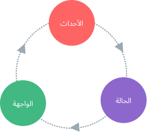

#  إدارة الحالة{#state-management}

## ما هي إدارة الحالة؟ {#what-is-state-management}

تقنيا، "تدير" كل نسخة مكون  Vue حالتها التفاعلية. اختر مثالا بسيطا مثل مكون العداد:

<div class="composition-api">

```vue
<script setup>
import { ref } from 'vue'

// الحالة
const count = ref(0)

// الأحداث
function increment() {
  count.value++
}
</script>

<!-- الواجهة -->
<template>{{ count }}</template>
```

</div>
<div class="options-api">

```vue
<script>
export default {
  // الحالة
  data() {
    return {
      count: 0
    }
  },
  // الأحداث
  methods: {
    increment() {
      this.count++
    }
  }
}
</script>

<!-- الواجهة -->
<template>{{ count }}</template>
```

</div>

إنها وحدة مستقلة تحتوي على الأجزاء التالية:

- **الحالة**، مصدر الحقيقة الذي يوجه التطبيق;
- **الواجهة**، تجسيد تصريحي لل**الحالة**;
- **الأحداث**، الطرق الممكنة التي يمكن أن تغير الحالة بالرد على إدخالات المستخدم من **الواجهة**.

هذا تمثيل بسيط لمفهوم "التدفق أحادي الإتجاه للبيانات ":

<p style="text-align: center">
  
</p>

ومع ذلك ، تبدأ البساطة في الانهيار عندما يكون لدينا ** مكونات متعددة تشترك في حالة مشتركة **:

1. أكثر من واجهة قد تعتمد على نفس الحالة.
2. قد تحتاج الأحداث من واجهات مختلفة إلى تغيير نفس الحالة.

بالنسبة للحالة الأولى ، يمكن أن يكون الحل هو محاولة "رفع" الحالة المشتركة إلى المكون الجذري ، ثم تمريرها إلى الأسفل كخاصيات. ومع ذلك ، يصبح هذا مملًا بسرعة في شجرة المكونات مع هرميات عميقة ، مما يؤدي إلى مشكلة أخرى معروفة باسم [التمرير العميق](/guide/components/provide-inject#prop-drilling).

بالنسبة للحالة الثانية ، نجد أنفسنا نتعامل مع بعض الحلول مثل الوصول إلى نسخ المكون الأب / الإبن المباشرة عبر مرجع القالب، أو محاولة تغيير ومزامنة نسخ متعددة من الحالة عبر الأحداث المنشورة. كلا هذين النموذجين غير متينين ويؤديان بسرعة إلى شيفرة غير قابلة للصيانة.

حل أبسط وأكثر وضوحًا هو استخراج الحالة المشتركة من المكونات ، وإدارتها في نسخة واحدة عامة. مع هذا، تصبح شجرة المكونات لدينا "كواجهة كبيرة" ، ويمكن لأي مكون الوصول إلى الحالة أو تشغيل الأحداث، بغض النظر عن تموضعم في الشجرة!

## إدارة بسيطة للحالة عبر واجهة التفاعلية {#simple-state-management-with-reactivity-api}

<div class="options-api">

في واجهة الخيارات،  تُعرف البيانات التفاعلية باستخدام خيار `()data`. داخليًا، يُجعل الكائن المعاد من `()data`  تفاعليا عبر دالة [`()reactive`](/api/reactivity-core#reactive) ، والتي أيضًا متاحة كواجهة برمجية عامة.

</div>

إذا كان لديك جزء من الحالة يجب مشاركته بين عدة نسخ ، يمكنك استخدام [`()reactive`](/api/reactivity-core#reactive) لإنشاء كائن تفاعلي ، ثم استيراده إلى عدة مكونات:

```js
// store.js
import { reactive } from 'vue'

export const store = reactive({
  count: 0
})
```

<div class="composition-api">

```vue
<!-- ComponentA.vue -->
<script setup>
import { store } from './store.js'
</script>

<template>من المكون A: {{ store.count }}</template>
```

```vue
<!-- ComponentB.vue -->
<script setup>
import { store } from './store.js'
</script>

<template>من المكون B: {{ store.count }}</template>
```

</div>
<div class="options-api">

```vue
<!-- ComponentA.vue -->
<script>
import { store } from './store.js'

export default {
  data() {
    return {
      store
    }
  }
}
</script>

<template>من المكون A: {{ store.count }}</template>
```

```vue
<!-- ComponentB.vue -->
<script>
import { store } from './store.js'

export default {
  data() {
    return {
      store
    }
  }
}
</script>

<template>من المكون B: {{ store.count }}</template>
```

</div>

الآن عندما يتم تغيير كائن `()store` ، سيتم تحديث وجهات نظر `<ComponentA>` و `<ComponentB>` تلقائيًا - لدينا مصدر واحد للحقيقة الآن.

ومع ذلك ، يعني هذا أيضًا أن أي مكون يستورد `()store` يمكنه تغييره كما يريد:

```vue-html{2}
<template>
  <button @click="store.count++">
     B من المكون: {{ store.count }}
  </button>
</template>
```

على الرغم من أن هذا يعمل في الحالات البسيطة، إلا أن الحالة العامة التي يمكن تغييرها عشوائيًا بواسطة أي مكون لن تكون قابلة للصيانة بشكل مستدام. لضمان مركزية منطق تغيير الحالة مثل مركزية الحالة نفسها، ينصح بتعريف التوابع على المخزن المركزي بأسماء تعبر عن المراد من الأحداث:

```js{6-8}
// store.js
import { reactive } from 'vue'

export const store = reactive({
  count: 0,
  increment() {
    this.count++
  }
})
```

```vue-html{2}
<template>
  <button @click="store.increment()">
    من المكون B: {{ store.count }}
  </button>
</template>
```

<div class="composition-api">

[[اختبرها في حقل التجارب](https://play.vuejs.org/#eNrNkk1uwyAQha8yYpNEiUzXllPVrtRTeJNSqtLGgGBsVbK4ewdwnT9FWWSTFczwmPc+xMhqa4uhl6xklRdOWQQvsbfPrVadNQ7h1dCqpcYaPp3pYFHwQyteXVxKm0tpM0krnm3IgAqUnd3vUFIFUB1Z8bNOkzoVny+wDTuNcZ1gBI/GSQhzqlQX3/5Gng81pA1t33tEo+FF7JX42bYsT1BaONlRguWqZZMU4C261CWMk3EhTK8RQphm8Twse/BscoUsvdqDkTX3kP3nI6aZwcmdQDUcMPJPabX8TQphtCf0RLqd1csxuqQAJTxtYnEUGtIpAH4pn1Ou17FDScOKhT+QNAVM)

</div>
<div class="options-api">

[[اختبرها في حقل التجارب](https://play.vuejs.org/#eNrdU8FqhDAU/JVHLruyi+lZ3FIt9Cu82JilaTWR5CkF8d8bE5O1u1so9FYQzAyTvJnRTKTo+3QcOMlIbpgWPT5WUnS90gjPyr4ll1jAWasOdim9UMum3a20vJWWqxSgkvzTyRt+rocWYVpYFoQm8wRsJh+viHLBcyXtk9No2ALkXd/WyC0CyDfW6RVTOiancQM5ku+x7nUxgUGlOcwxn8Ppu7HJ7udqaqz3SYikOQ5aBgT+OA9slt9kasToFnb5OiAqCU+sFezjVBHvRUimeWdT7JOKrFKAl8VvYatdI6RMDRJhdlPtWdQf5mdQP+SHdtyX/IftlH9pJyS1vcQ2NK8ZivFSiL8BsQmmpMG1s1NU79frYA1k8OD+/I3pUA6+CeNdHg6hmoTMX9pPSnk=)

</div>

:::tip ملاحظة
تجدر الملاحظة أن معالج النقر يستخدم `()store.increment` مع الأقواس - هذا ضروري لاستدعاء الدالة في سياق `this` المناسب لأنها ليست دالة تابعة للمكون.
:::

على الرغم من أننا نستخدم هنا كائنًا متغيرًا واحدًا كمخزن، يمكنك أيضًا مشاركة الحالة المتغيرة التي أنشئت باستخدام واجهات [التفاعلية](/api/reactivity-core) الأخرى مثل `()ref` أو `()computed`، أو حتى إرجاع الحالة العامة من [الدالة التركيبية](/guide/reusability/composables):

```js
import { ref } from 'vue'

//حالة عامة، أنشئت في نطاق الوحدة
const globalCount = ref(1)

export function useCount() {
  //حالة محلية، أنشئت لكل مكون
  const localCount = ref(1)

  return {
    globalCount,
    localCount
  }
}
```

حقيقة أن نظام التفاعلية في Vue مفصول عن نموذج المكون يجعله مرنًا للغاية.

## اعتبارات التصيير من جانب الخادوم {#ssr-considerations}

إذا كنت تبني تطبيقًا يستفيد من [التصيير من جانب الخادوم (SSR)](./ssr)، فقد يؤدي النمط أعلاه إلى مشاكل بسبب المخزن الذي يكون متغيرًا واحدًا مشتركًا عبر عدة طلبات. يُناقش هذا [بالتفصيل](./ssr#cross-request-state-pollution) في دليل SSR.

## مكتبة Pinia  {#pinia}

على الرغم من أن حلنا لإدارة الحالة سيكفي في السيناريوهات البسيطة، إلا أنه يوجد العديد من الأمور التي يجب اعتبارها في التطبيقات الإنتاجية الكبيرة:

- اصطلاحات متينة للتعاون بين الفريق
- الدمج مع أدوات تطوير Vue، بما في ذلك الجدول الزمني وفحص المكون وتصحيح الأخطاء في الوقت الحقيقي
- الاستبدال النشط للوحدات
- دعم التصيير من جانب الخادوم

[Pinia](https://pinia.vuejs.org) هي مكتبة إدارة الحالة تقوم كل ما سبق. و هي تحت التطوير و الصيانة من طرف فريق Vue الأساسي، وتععمل مع  إصداري Vue 2 و Vue 3.

يمكن أن يكون المستخدمون الحاليون معتادين على [Vuex](https://vuex.vuejs.org/)، مكتبة إدارة الحالة الرسمية السابقة لـ Vue. مع هذا Pinia تقوم بنفس الدور في النظام البيئي،  Vuex الآن في وضع الصيانة. لا تزال يعمل، ولكن لن تتلقى المزيد من الميزات الجديدة. ينصح باستخدام Pinia للتطبيقات الجديدة.

بدأ Pinia كاستكشاف لما يمكن أن يبدو كمرحلة تالية من Vuex، وتضمين العديد من الأفكار من مناقشات الفريق الأساسي لـ Vuex 5. في النهاية، وجدنا أن Pinia تنفذ بالفعل معظم ما نريده في Vuex 5، وقررنا جعلها الاقتراح الجديد بدلاً من ذلك.

بالمقارنة مع Vuex، يوفر Pinia واجهة برمجية أبسط مع أقل تعقيدات، و التي تعتبر متطابقة مع الواجهة التركيبية، والأمر الأكثر أهمية، هو توفير دعم استدلال متين للأنواع عند استخدامه مع TypeScript.
